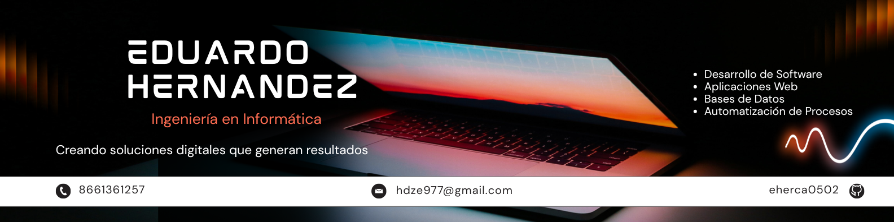

  

<h1 align="center">Eduardo Hernández Campos </h1>

  <strong>Software Developer • Web Developer</strong>

Desarrollo aplicaciones web enfocadas en automatizar procesos y mejorar la operación de negocios.

  

  

  

---

## 💡 About Me

Soy Ingeniero Informático con interés en el desarrollo de software y aplicaciones web.

Me gusta construir soluciones que resuelvan problemas reales, desde sistemas administrativos hasta plataformas web orientadas a negocios. Mi enfoque está en desarrollar aplicaciones funcionales, intuitivas y escalables utilizando tecnologías modernas del ecosistema web.

Actualmente continúo fortaleciendo mis conocimientos en desarrollo full stack, bases de datos y arquitectura de software.

---

## 🚀 Tech Stack

---

## 📌 Featured Projects

###  Restaurant Management System

Sistema web desarrollado para la administración y operación de restaurantes.

**Funciones principales**

- Gestión de pedidos
- Control de mesas
- Corte de caja
- Inventario
- Control de usuarios y roles
- Reportes PDF
- Impresión de tickets
- Panel administrativo

---

###  Cyclonova

Sitio web corporativo diseñado para fortalecer la presencia digital de la empresa y presentar sus servicios de forma profesional.

**Características**

- Diseño responsive
- Optimización para dispositivos móviles
- Formulario de contacto
- Interfaz moderna
- Experiencia de usuario enfocada en conversión

---

## 🎯 Professional Goal

Continuar creciendo como desarrollador de software, participando en proyectos que generen impacto real mediante soluciones tecnológicas innovadoras, eficientes y centradas en el usuario.

---

  <i>"The best way to predict the future is to create it."</i>

